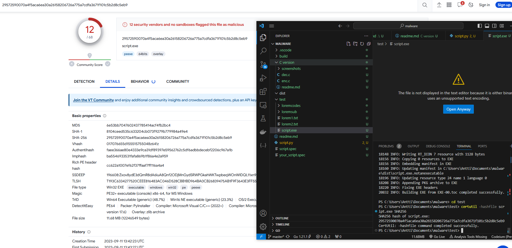

# Malware

## Video https://streamable.com/y8dhpk

    Needs pycryptodome, pyinstaller and python 3.6+
    ```pip install pycryptodome```
    ```pip install pyinstaller```
    To build either
    ```pyinstaller --onefile script.py```
    or
    ```pyinstaller --onefile --hidden-import=pycryptodome script.py```

    Then move the EXE from dist into the test folder and run it with ```./script.exe```

    In the test folder you can compile the C codes if you want
    ```gcc -o xyz xyz.c```
    Just replace xyz with the name and voila.
    Then you can test some random binaries.

    VT 12/68 - 83% 

     

### PS: Don't encrypt multiple times
### PPS: The C version was better but WD was being an ass about the decryptor :/

## Ransomware
    Ransomware is a malicious software or malware that operates with the primary purpose of extorting money from individuals, businesses, or organizations. Here's a more detailed explanation of how ransomware works and its various aspects:

    Infection: Ransomware typically infects a victim's computer or network through deceptive means, such as malicious email attachments, infected software downloads, or exploiting vulnerabilities in outdated software. Once the ransomware gains access to the system, it begins its malicious activities.

    Encryption: One common form of ransomware is called crypto-ransomware. It encrypts the victim's files, rendering them unreadable without a unique decryption key. The encryption process uses strong, sophisticated algorithms that are almost impossible to break without the decryption key.

    Ransom Note: After encrypting the victim's files, ransomware displays a ransom note on the victim's screen. This note usually demands payment in cryptocurrency, such as Bitcoin or Ethereum, and provides instructions on how to make the payment. It often includes a countdown timer to increase pressure on the victim.

## The program
    The encryption works by generating a new random key everytime it's run. It encrypts all files in the same folder as itself, including files in subfolders. This is for auditing purposes so an actual VM is notreally needed as long as it's not placed inside of important system folders. The encryption uses AES encryption from pycryptodome to generate the key, then encrypts the files with that key.

    The decryption is just the reverse of the encryption.

    For AV avoidance, for me the program worked even without adding anything special due to the fact that it starts from the folder that it is located. So it can be moved to root without needing to set that in the code itself. Thus windows defender doesn't consider it too malicious atleast.

    Other options to use would be: Loops-lot's of loops to artificially increase the runtime and the needed memory of the program to get the AV to give up. Then can add make the program sleep to increase the runtime even more. And Could do code injection into another process or even make a process chain. Code makes a new file and starts it then that makes a new file and starts it and so on.

    Overall the code itself:
    
    1.The Encryptor makes a random encryption key

    2.Writes the key into a file in the desktop
    
    3.Goes through the folders
    
    4.Reads in the file data by bytes
    
    5.Encrypts the bytes
    
    6.Makes a new file and writes the encrypted data there
    
    7.Deletes the old a file
    
    8.Repeats until all files inside of the root/current folder and subfolders are encrypted
    
    9.When used with the key as argument, it will decrypt the files